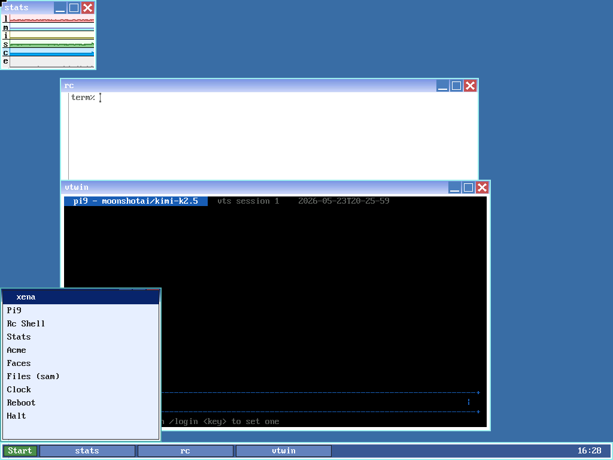
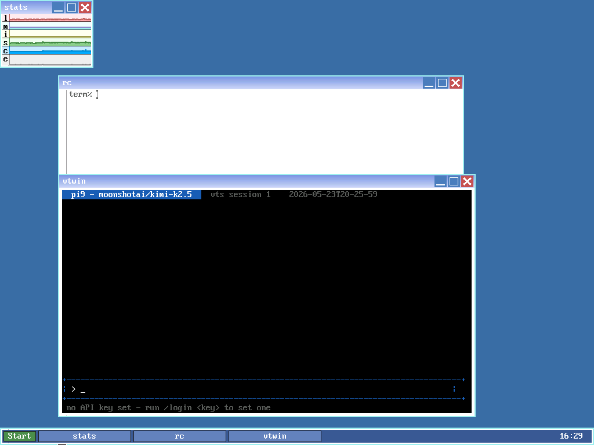

# agent9

A Windows XP-style desktop for [9front](http://9front.org) (Plan 9 from Bell
Labs), a Plan 9-native LLM coding agent, and a web browser. Boot the whole thing
as one QEMU image in about fifteen seconds, or install the pieces onto your own
9front with `pac9`, the package manager in this repo.



The Start menu shows the launcher's app list (Pi9, Rc Shell, Stats, Acme, Faces,
Files, Clock, Reboot, Halt). The vtwin window behind it is running pi9 — the cyan
title bar reads `pi9 — moonshotai/kimi-k2.5`.

## Built with AI

Most of agent9 — pi9, the python9 and node9 ports, the desktop plumbing — was
written with heavy AI assistance (Claude, with some Hermes), and the commit
history shows it. The results are real: pi9 gets dogfooded daily, python9 scores
100% parity on CPython's own core regression batch, and node9 runs the real npm
with 30 of 30 popular packages installing and running. I'd rather say so up front
than leave you to find it in the log.

## Two ways to get it

**Boot the image.** Download `agent9-v0.5.1.qcow2` from the
[Releases page](https://github.com/Alino/agent9/releases), drop it next to the
runner script for your OS, and run it:

```
# macOS
brew install qemu
./run-macos.sh

# Linux (KVM if available)
sudo apt install qemu-system-x86
./run-linux.sh

# Windows: install QEMU, then double-click run-windows.bat
```

The image boots unattended — after about fifteen seconds you land on the
desktop. You can also attach resizable desktops from your host with drawterm
(`drawterm -h tcp!127.0.0.1!17019 -a tcp!127.0.0.1!1567 -u glenda`, password
`agent9agent9`). `release/RUNNING.md` has the details.

**Or install onto your own 9front.** If you already run 9front you don't need the
image. Everything here installs with `pac9`, one line at a time. That's the rest
of this section.

## Installing software with pac9

pac9 fetches, builds, and installs a package in a single command:

```rc
pac9 install pi9
pac9 install python9
pac9 install https://github.com/user/repo    # any external git repo
```

There's nothing clever under the hood, and that's the point. 9front already
ships `git/clone` (git9) to fetch a repo and the `mk install` convention to build
it. pac9 wires those together, adds a registry of short names for the software in
this repo, and keeps a record of what you've installed so you can list and remove
it later.

### Put pac9 on the box

pac9 is a single rc script. Fetch it and its registry with `hget` — both `hget`
and `git9` come with stock 9front, and you only need `webfs` running for the
https fetch, which is the default:

```rc
hget https://raw.githubusercontent.com/Alino/agent9/main/pac9/pac9 >/rc/bin/pac9
chmod +x /rc/bin/pac9
mkdir -p /sys/lib/pac9
hget https://raw.githubusercontent.com/Alino/agent9/main/pac9/registry >/sys/lib/pac9/registry
```

Prefer to clone? git9 handles that too:

```rc
git/clone https://github.com/Alino/agent9 /tmp/agent9
cd /tmp/agent9/pac9 && rc install.rc
```

Either way, `pac9` is now on your path.

### Install what you want

| Command | What you get |
|---|---|
| `pac9 install pi9` | the LLM coding agent (pulls in vts and vtwin automatically) |
| `pac9 install python9` | CPython 3.11 with the stdlib |
| `pac9 install node9` | a Node-compatible runtime and the real npm |
| `pac9 install cc9` | modern C++ on the box — `cc foo.cpp` (clang + lld + libc++) |
| `pac9 install rust9` | the real `rustc` running on 9front — `rustc hello.rs` compiles, links, and runs natively |
| `pac9 install zig9` | the Zig compiler running on 9front — `zig build-exe hello.zig` compiles natively (no LLVM) |
| `pac9 install go` | the real Go toolchain (upstream go1.26.0) — `go build` runs natively |
| `pac9 install gl9` | OpenGL 3.3 (Mesa softpipe) — `gl9 cube` / `gl9 egl` (pulls in gl9win) |
| `pac9 install alacritty9` | real Alacritty 0.17.0, the GPU terminal, in a rio window — run `alacritty9` |
| `pac9 install neovim9` | real Neovim 0.12.4 — run `nvim` inside alacritty9 (treesitter, jobs, `:terminal`, LSP) |
| `pac9 install netsurf` | the NetSurf web browser |
| `pac9 install mxio` | the window manager |
| `pac9 install vts vtwin` | the terminal server and its window |
| `pac9 install xena-panel launcher` | the taskbar and Start menu |

Pass as many packages as you like in one command, as the last two rows show. If a
package declares dependencies, pac9 installs the missing ones first — `pac9
install pi9` brings vts and vtwin along without you asking.

Anything that isn't a known name is treated as a **git URL** — pac9 clones it and
builds it if it follows a convention it recognises: a Plan 9 `mkfile`
(`mk install`), a `build.rc`, or an autotools/POSIX `configure`/`Makefile` (built
under APE, `ape/sh configure` → `ape/make install`). So an external repo laid out
the 9front way installs with just its URL, no registry entry needed.

Repos that need a POSIX environment 9front's APE can't fully provide are still
cloned, but you finish the build by hand — e.g. `pac9 install
https://github.com/dharmatech/ocaml` fetches the OCaml Plan 9 port, but its
autoconf `configure` doesn't complete under APE (missing `expr`, `sed`
differences), so pac9 leaves the source in `$home/src/pac9/ocaml` for you rather
than recording a failed install. `pac9 list` shows what's installed; `pac9
uninstall <name>` removes it.

The large ports — python9, node9, cc9, rust9, pi9 — install as prebuilt tarballs rather
than building on the box, since their sources are too big to compile on the VM in
any reasonable time. `pac9 install cc9` gives you the on-box C++ toolchain
(`cc foo.cpp -o foo` runs clang → ld.lld → elf2aout, all on 9front). To add your
own packages or change how one builds, see [`pac9/README.md`](pac9/README.md).

**zig9** now runs the Zig compiler *natively on 9front* (`pac9 install zig9`) —
bootstrapped through Zig's C backend and cc9. The full workflow works on-box:
`zig build` (build.zig projects, `-D` options, cached rebuilds), `build-exe`,
`run`, and `test`. It also remains usable as a host cross-compiler. See
[`zig9/`](zig9/).

## What's in the box

| Component | What it is | Lang |
|---|---|---|
| **mxio** | Window manager. A rio fork with Luna titlebars, decorations, drag, z-order, and minimize/maximize/close. | C / libdraw |
| **xena-panel** | Taskbar daemon: Start button, window list, clock. | C / libdraw |
| **launcher** | The Start menu popup, launching apps through the plumber. | C |
| **vts** | Terminal session server. A 9P file server that multiplexes VT100 sessions into one filesystem at `/srv/vts`. | C |
| **vtwin** | The libdraw front end for vts. Reads cell diffs and paints them into a rio window. | C / libdraw |
| **pi9** | Plan 9-native LLM coding agent. Bubble Tea TUI, streaming, tool calling, session trees, skills and memory, headless modes, OAuth to Anthropic, GitHub Copilot, and OpenAI. At feature parity with upstream [pi](https://pi.dev). | Go |
| **python9** | CPython 3.11.14 ported to 9front, at 100% parity against CPython's own regression suite. | C |
| **node9** | A Node-compatible runtime on QuickJS-ng (not V8) running unmodified npm 10 over real TLS. 30 of 30 popular packages install and run. | C / JS |
| **cc9** | Modern C++ on 9front via a clang/LLVM cross-toolchain that emits native a.out — exceptions, the STL, threads, `<regex>`, `<filesystem>`, RTTI, and Stockfish 11. clang and lld also run on the box. | C++ / LLVM |
| **zig9** | The Zig compiler for 9front through Zig's own self-hosted backend, no LLVM. Passes 1792 of Zig's upstream `test/behavior` tests on 9front (0 fail). Pins Zig 0.14.1, the last release with a Plan 9 backend. **The compiler runs natively on 9front** (bootstrapped via Zig's C backend + cc9) — `pac9 install zig9`, then the real workflow on-box: **`zig build`** (build.zig projects, cached rebuilds in ~15 s), `build-exe`, `run`, `test`; proven bit-exact on a heavy ray tracer and a SHA-256/HashMap demo vs an aarch64 reference. | Zig |
| **rust9** | Rust on 9front: `x86_64-unknown-plan9` as a built-in rustc target + a `std` port (`std::sys::pal::plan9`) over the cc9 runtime. **The real `rustc` (1.98-dev, cranelift backend) runs on 9front itself** — `pac9 install rust9` gives you `rustc hello.rs` compiling, linking (via the from-scratch `n9link` ELF→a.out linker, also on-box), and running natively. std covers threads + real `Mutex`/`Condvar`, `panic=unwind`, fs (perms/mtime/canonicalize), `std::process` (spawn/pipes/`try_wait`), TCP **and UDP** over `/net`, per-thread errno, real kernel error strings. ~2309 of Rust's own `coretests` pass, 0 Rust-side failures. Flagship `rgrep` uses the real crates.io `regex`. | Rust / LLVM |
| **gl9** | OpenGL 3.3 on 9front via Mesa's softpipe (software rasteriser), cross-compiled with cc9. Presents to a libdraw window through **gl9win**; `gl9 cube` draws a spinning lit 3D cube, `gl9 egl` a triangle through the EGL API. | C / Mesa |
| **go** | The real Go toolchain, upstream go1.26.0 — plan9/amd64 is a supported upstream port, so this is packaging, not a port: built once with Go's own `bootstrap.bash`, installed to `/sys/lib/go`. `go build` compiles and runs natively on the box (goroutines, channels, the lot). No cgo, as upstream. | Go |
| **alacritty9** | Real upstream Alacritty 0.17.0 — the GPU-accelerated terminal — running in a rio window on stock 9front. Built on rust9 + gl9: a new winit Plan 9 backend, an EGL-over-OSMesa context, pure-Rust font rasterization (Go Mono), rc on pipes with a 9term-style line discipline, `/dev/snarf` clipboard, and damage/scroll-blit presentation that gets keystrokes to ~25ms on a fanless box. Full-screen TUIs work — pi9 runs inside it. | Rust / C |
| **neovim9** | Real upstream Neovim 0.12.4 with treesitter highlighting, jobs, an interactive `:terminal`, and LSP over stdio — the full TUI inside alacritty9 on bare metal. The port forced cc9 to grow `poll(2)`, real `fork`/`execve`, and child reaping; LuaJIT runs in interpreter mode (stock 9front is W^X), treesitter parsers are linked in statically. Keystroke→pixels ~22ms; a 300-file directory relists in 60ms. | C / Lua |
| **NetSurf** | A web browser, from [netsurf-plan9](https://github.com/netsurf-plan9). | C |

Each component has its own README with the real detail — the parity contracts,
the build recipes, and the kencc/APE bug classes that had to be worked around.
Start with [`python9/README.md`](python9/README.md),
[`node9/DOCUMENTATION.md`](node9/DOCUMENTATION.md), [`cc9/README.md`](cc9/README.md),
[`rust9/README.md`](rust9/README.md), [`alacritty9/README.md`](alacritty9/README.md),
and [`zig9/`](zig9/).



pi9 in vtwin. The cyan header shows the current model and vts session id; the
dashed box is where you type. The status line is telling you to set an API key
with `/login`.

## Status

This is **v0.5.1**, which preinstalls **pac9** (the package manager) in the image
(issue #9). v0.5.0's headline was cc9 growing up: its C++ runtime now passes
the full upstream conformance triad (libc++, libc++abi, libunwind) with zero
runtime failures, a reduced clang and lld run natively on 9front, and the image
ships a Stockfish 11 demo whose `bench` self-verifies to the exact reference node
count. Earlier releases added node9 (v0.3.0) and the python9 port plus pi9's climb
to pi parity (v0.2.0).

The basics work and get used daily. The rough edges I know about:

- pi9's TUI header occasionally scrolls off-screen after a clear.
- Mouse-wheel scrolling in pi9 is written but not yet tested with real input
  devices — QMP can't simulate it cleanly.
- The launcher's app list is hardcoded C, so adding an entry means a recompile. A
  config-file rewrite is planned.
- The file manager (`xfiles`) is a stub, and its Start-menu entry does nothing
  yet. Use acme or rc for now.

## Why

Two reasons.

I wanted a modern coding agent on Plan 9, the way pi.dev runs on Mac and Linux. Pi
is TypeScript on Node, and Node doesn't run on Plan 9, so I rebuilt its shape in Go
with Bubble Tea — the same OAuth flows, slash commands, model picker, session tree,
and skills system. Then I added tools that only make sense here: `plumb`, `walk`,
`ns`, `bind`, `mount`. The agent can compose a namespace sandbox in a single tool
call and read its own runtime as files, which a Linux agent simply can't do.

And Plan 9 ships with `rio`, which Plan 9 people love and everyone else finds
alien. I wanted to see what 9front feels like wearing a window manager you already
recognize. It feels fine, as it turns out. mxio keeps rio's tiling sweep but adds
the chrome people expect: titlebars, minimize/maximize/close, a taskbar, a Start
button. The Luna palette is hardcoded rather than themed. v0.1 isn't built to be
configurable — it's built to be a comfortable place to land.

## How it fits together

```
  ┌─────────────────────────────────────────────────────────┐
  │ vtwin (libdraw cell-grid renderer)                      │
  │   ↓ reads /n/vts/<sess>/cells (binary diff stream)      │
  │   ↑ writes /n/vts/<sess>/cons (keystrokes)              │
  │                                                         │
  │ vts (9P session server at /srv/vts)                     │
  │   ↓ VT100 parser, cellbuf maintenance                   │
  │   ↓ ptyfork-equivalent (rfork) into rc                  │
  │                                                         │
  │ pi9 / acme / rc / netsurf / anything                    │
  │                                                         │
  │ mxio (window manager, drawn from rio.c +titlebars)      │
  │ xena-panel (taskbar; reads /dev/wsys for window list)   │
  │ launcher (start menu, plumber-driven app launch)        │
  └─────────────────────────────────────────────────────────┘
```

### vts and vtwin: a VT100 terminal, the Plan 9 way

Plan 9's built-in terminal — a rio window — is not a VT100/ANSI terminal. It's a
cooked text window with no notion of color codes, cursor addressing, or an
alternate screen. So a modern terminal UI, anything that draws with ANSI escapes
like pi9's Bubble Tea interface or a full-screen app like vim or htop, comes out as
garbage in a plain rio window. That's why running `pi9` straight in a terminal
fails: it emits escapes nothing there understands. On Unix you'd reach for `st` +
`tmux` + a libvterm; Plan 9 ships none of that.

**vts**, the VT session server, supplies the missing terminal logic as a 9P file
server rather than a library. It starts an `rc` shell in each session, reads that
shell's output through a full VT100/ANSI parser, and keeps the screen as a grid of
character cells. Each session is a directory under `/srv/vts` (mounted at
`/n/vts/<session>/`) — the terminal is a filesystem:

- `cons` — read program output, write keystrokes (what you type)
- `cells` — the rendered grid, as a binary diff stream
- `ctl` — create, kill, redraw sessions (`echo new <name> > /n/vts/ctl`)
- `scroll` — scrollback

**vtwin**, the VT window, is the graphical half: a small libdraw program that opens
a window in mxio/rio, reads a session's `cells` and paints the grid, and writes
your keyboard and mouse input back to `cons`. It's a dumb renderer; all the
terminal smarts live in vts.

Splitting the terminal logic (vts) from the window (vtwin) is the whole payoff. The
session and the program inside it outlive any window — close the vtwin and the
rc or pi9 inside keeps running, then point a fresh vtwin at the same session to
reattach. It's tmux detach and attach, done as files. It also means anything can
drive a session: `new-pi9` just writes `echo new ... > /n/vts/ctl`, drops `pi9`
into the session's `cons`, and launches a vtwin on it.

## Hacking on it

The image keeps the source under
`/sys/src/cmd/{mxio,vts,vtwin,xena-panel,launcher}/`, ready to `mk`. Edit on the
host and shuttle changes into the VM with the listen1 + http pattern in `tools/`,
or just ssh in (`ssh -p 2222 glenda@localhost`, no password) and edit with acme.

There's no cross-build from macOS — Plan 9 has no hosted toolchain, so C builds
happen in the VM:

```
cd /sys/src/cmd/mxio && mk install
```

pi9 is the exception, since Go cross-compiles from any host:

```
cd src/pi9 && GOOS=plan9 GOARCH=amd64 go build .
```

Day-to-day workflow patterns are in `docs/development.md`.

## Credits

- [Plan 9 from Bell Labs](https://9p.io/plan9/) / [9front](http://9front.org) — the OS this all runs on.
- [pi.dev](https://pi.dev) — the agent shape pi9 mirrors. Source at <https://github.com/earendil-works/pi>.
- [charm.sh](https://charm.sh) — Bubble Tea, Lipgloss, and Bubbles, the TUI stack pi9 builds on.
- [netsurf-plan9](https://github.com/netsurf-plan9) — the NetSurf port.

## License

MIT. See LICENSE.
