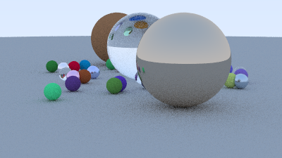

# cc9 — modern C++ for 9front, cross-compiled with clang/LLVM

9front (Plan 9) has no modern C++ compiler. kencc is C-only, APE has no C++
runtime, and the only native C++ is cfront 3.0.1 (1980s, no templates/STL). That
wall blocked V8, native npm addons, Rust, and a large slice of modern software.

**cc9 removes the wall by cross-compiling.** The compiler does *not* run on Plan 9.
A host **clang/LLVM** targets `x86_64`, a from-source **libc++/libc++abi** + a small
runtime bridge supply the standard library over Plan 9 syscalls, and an
**ELF→a.out converter** repackages the output so it runs on a **stock, unmodified
9front amd64 kernel**.

The result: **full modern C++ runs on 9front** — exceptions, the STL, iostreams,
threads, `<regex>`, wide characters, `<filesystem>`, RTTI, `thread_local`,
`std::filesystem`, and real third-party libraries (nlohmann/json) — validated
against libc++'s own conformance suite at ~100% of applicable tests.

## Gallery — what cc9 makes possible

A **C++ path tracer** (Peter Shirley's "Ray Tracing in One Weekend" — pure
`<cmath>` + STL + `std::thread`, ~250 lines, no external libraries) rendering on
9front. Reflections, refraction through glass, soft shadows from diffuse bounces,
gamma — all computed by native C++ on a stock Plan 9 kernel. There is no Go
equivalent that *is* this; native C++ compute is something cc9 uniquely brings to
Plan 9. (`cc9/test/raytrace.cpp`)



*The image above is the binary's actual output: it ran on the 9front VM and wrote
a 270,015-byte `P6` PPM (15-byte header + 400×225×3 pixels); that file was pulled
off the VM with `xd` (listen1 corrupts raw binary) and re-encoded to PNG. The
grain is the 24-sample path tracing.*

And the demo the existing Go runtime **cannot** match on Plan 9 — a **brainfuck
JIT** that emits x86-64 machine code at runtime and executes it. Stock 9front
NX-enforces all writable memory; cc9's opt-in W^X kernel patch is what unlocks it:

```text
$ bfjit            # gate off (wxallow=0): NX blocks it
bfjit 584: suicide: sys: trap: fault read addr=0x7ffffeffe000

$ bfjit            # gate on (wxallow=1): runs the JIT'd code
bfjit: compiled BF to 372 bytes of x86-64, executed it -> "Hello World!"

$ exceptions       # throw/catch, RAII unwinding across frames, rethrow
unwind=3 base=ok rethrow=ok custom=7 what=too big PASS

$ threads          # 100 std::threads + thread_local + std::call_once
sum=4950 tls=ok once=1 staticctor=1 PASS
```
(`cc9/test/bfjit.cpp`, `cc9/test/suite/`)

## Quick start

```sh
# prerequisites (host): brew llvm + lld; a from-source libc++ header tree; openlibm
#   (see "Building the runtime" below). Then:
cc9/host/cc9 build prog.cpp          # -> /tmp/prog.cpp.aout  (a Plan 9 a.out)
cc9/host/cc9 run   prog.cpp          # build, ship to the 9front VM, run it
```

```cpp
// prog.cpp — this compiles and runs on 9front:
#include <iostream>
#include <vector>
#include <algorithm>
#include <stdexcept>
int main() {
    std::vector<int> v{5,3,8,1};
    std::sort(v.begin(), v.end());
    try { throw std::runtime_error("ok"); }
    catch (const std::exception& e) { std::cout << e.what() << " "; }
    for (int x : v) std::cout << x << ' ';
    std::cout << '\n';
}
```

## How it works

```
  prog.cpp
     │  clang++ --target=x86_64-unknown-none -nostdlib -fexceptions -frtti
     │          -funwind-tables -fno-pic -femulated-tls   (freestanding SysV LP64)
     │          -isystem <from-source libc++ headers> -isystem cc9/runtime/include
     ▼
  prog.o ──┐
           │  ld.lld -T cc9/test/plan9.ld  --start-group libcc9cxx.a libcc9m.a --end-group
           ▼
  prog.elf
     │  cc9/host/elf2aout.py        (ELF -> Plan 9 amd64 a.out; vaddrs preserved)
     ▼
  prog.aout  ──►  runs on stock 9front amd64
```

- **Code model / ABI.** clang emits ordinary System V x86_64. The runtime reaches
  the Plan 9 kernel only through hand-written **syscall thunks**
  (`test/n9syscall.s`) that marshal SysV register-args into the Plan 9 ABI (args on
  the stack, syscall number in `RBP`, `SYSCALL`). Everything links statically; there
  is no dynamic loader on a.out.
- **Layout.** `plan9.ld` lays text (R+X) at `0x200028` and the data+bss segment at
  the next 2 MB boundary (where the 9front kernel maps it). `.eh_frame` is KEPT in
  the text segment so the bare-metal unwinder can find it. `elf2aout.py` repackages
  by vaddr into the 40-byte-header Plan 9 a.out format.

## The runtime bridge (`cc9/runtime`, packaged as `lib/libcc9cxx.a`)

| Piece | What it provides |
|---|---|
| `n9syscall.s` | SysV→Plan9 syscall thunks (pwrite/pread/open/brk/rfork/sem*/stat/wstat/…). **Saves/restores all SysV callee-saved regs around `SYSCALL`** — the Plan 9 kernel clobbers rbx/rbp/r13. |
| `crt0.c` | `_start`, `.init_array`/`.fini_array`, `atexit`/`__cxa_atexit`, an 8 MiB BSS main stack (shared via RFMEM so thread captures work), and **FP-exception masking** (bare-metal 9front traps on div-by-zero otherwise). |
| `n9libc.c` | freestanding libc: a K&R heap over the `brk` syscall (overflow-guarded `malloc`/`calloc`/`realloc`/`aligned_alloc`), `mem*`/`str*`, `strto*` (base/0x/sign/exponent), ctype, `strftime`, time over `/dev/bintime`, GCC atomic/fenv shims. |
| `printf.c` | real `vsnprintf`/`vsscanf` incl. float conversion (long-double digit extraction over openlibm) and precision. |
| `stdio.c` | `FILE` layer over Plan 9 fds (stdio + real files; short-transfer-safe `fwrite`/`fread`). |
| `fs.c` | POSIX-over-9P: `open`/`stat`/`read`/`dir`/`wstat` (a slice of APE) backing `std::filesystem` + `std::fstream`. |
| `pthread.c` | pthreads over `rfork(RFMEM)` + semaphores: create/join/detach, mutex/condvar/once, TLS + emulated-TLS (`thread_local`), keyed by a stack-region thread id. |
| `cxxrt.cpp`, `exception_ptr.cpp`, `tochars.cpp`, `typeinfo_min.cpp` | `operator new/delete`, thread-safe static guards, `std::exception_ptr`/`rethrow_exception`, float `to_chars`, `type_info`. |
| from-source **libc++/libc++abi** objects | the STL runtime (string/locale/ios/regex/filesystem/chrono/…) + the **DWARF exception runtime** (libunwind bare-metal). |
| `lib/libcc9m.a` | **openlibm** cross-compiled for the target — a real correctly-rounded libm with 80-bit `long double`. |

**Exceptions** use the DWARF path (clang's x86_64 SJLJ codegen is buggy). libunwind
is built bare-metal and finds `.eh_frame` via linker symbols — no dynamic loader
needed. **Threads** use `rfork(RFMEM)`; main and thread stacks live in shared memory
so `std::thread([&]{…})` captures work.

## What runs

Verified on real 9front: **C++ exceptions** (throw/catch, RAII unwinding,
rethrow, `e.what()`), **STL** (vector/string/map/unordered/set/optional/sort…),
**iostreams** (`std::cout`/`cin`/stringstreams, formatted I/O), **threads**
(`std::thread`/mutex/condvar/future/`call_once`/atomics), **`<regex>`**,
**wide characters** (`std::wstring`/`wcout`), **`<filesystem>`** + `std::fstream`,
**RTTI** (`dynamic_cast`/`typeid`), **`thread_local`**, **`std::format`** floats,
and **nlohmann/json** (a real third-party library: parse + mutate + serialize).

### Conformance parity

`cc9/host/run-libcxx-tests.sh <category> <N>` runs the **actual upstream libc++
conformance suite** (`libcxx/test/std/**/*.pass.cpp` from the LLVM tree) through
cc9 on the VM — compile + link + convert + run; a `.pass.cpp` asserts internally,
so a clean exit is a pass. It honors libc++'s own feature model (a test marked
`UNSUPPORTED` for a feature cc9 lacks is a skip, not a failure — what upstream
`lit` does). Recent sweeps: **~100% of applicable tests pass, with `rfail=0`** —
nothing that compiles and links has ever miscompiled or faulted on 9front; the
gaps that remain are compile/link-time (genuinely unsupported features), not
runtime bugs. The hand-written smoke/regression suite lives in `test/suite/`
(run with `cc9/host/run-tests.sh`).

## Optional JIT — the W^X kernel patch (`cc9/kernel`)

Stock 9front enforces NX on all writable memory, so a JIT (V8, LuaJIT) can't run.
A small, **opt-in** kernel patch (`cc9/kernel/`) adds a per-segment `SG_EXEC` flag
gated by a `plan9.ini` `wxallow` switch — **secure by default** (off ⇒ identical to
stock), executable-writable memory only when a process explicitly requests it and
the gate is on. Verified: with `wxallow=1`, a `segattach(SG_EXEC)` segment runs
generated machine code; everything else stays NX. This makes V8-class JIT
*reachable* on a patched kernel while leaving stock binaries unaffected (cc9's
static C++ never requests `SG_EXEC`). See `cc9/kernel/README.md`.

## Building the runtime

```sh
# one-time: a from-source libc++ header tree + openlibm (see docs/ for the recipe)
cc9/host/build-runtime.sh     # -> cc9/lib/libcc9cxx.a   (the C++ runtime archive)
cc9/host/build-libm.sh        # -> cc9/lib/libcc9m.a     (openlibm)
```

Environment: `CC9_LLVM` (brew llvm bin), `CC9_LLD` (ld.lld), `CC9_LIBCXX`
(from-source libc++ headers), `CC9_LLVMSRC` (llvm-project tree), `CC9_DEV`
(`host port` for the VM listener).

## Limitations (honest)

- **Host-only compiler.** cc9 cross-compiles; clang does not run on 9front
  (self-hosting is far off). Output is **static** a.out only (no dynamic linking —
  by design on Plan 9).
- **No Plan 9 native-lib linking.** cc9 code is internally SysV and reaches the
  kernel only through the syscall thunks; it cannot link against Plan 9's own libc
  or existing Plan 9 C libraries (that needs an LLVM Plan 9 calling-convention).
- **JIT needs the opt-in kernel patch** (above); stock 9front is NX-enforced.
- **Bare-metal FP** is masked at startup but only fully verifiable on real hardware
  (QEMU TCG doesn't trap on FP exceptions regardless).
- Minor documented gaps: `getenv` returns a shared static buffer; wide numeric
  parsing caps at 127 chars; `crt0` provides a stub `argv`/no `environ`.

The runtime has been through two adversarial multi-agent review rounds; see the
git history (`cc9: fix … from a full runtime review`).

## Layout

```
cc9/host/        cross-toolchain: cc9 wrapper, build-runtime.sh, build-libm.sh,
                 elf2aout.py, run-tests.sh, run-libcxx-tests.sh
cc9/runtime/     the runtime bridge (libc shim, C++ runtime, pthreads, fs, stdio)
cc9/runtime/include/  minimal C headers
cc9/test/        n9syscall.s, plan9.ld, demos (json/stl/…), suite/ (regression)
cc9/kernel/      optional W^X/JIT kernel patch (wxallow + SG_EXEC)
cc9/lib/         built archives (libcc9cxx.a, libcc9m.a)
cc9/vendor/      third-party headers used in demos (nlohmann/json)
```
