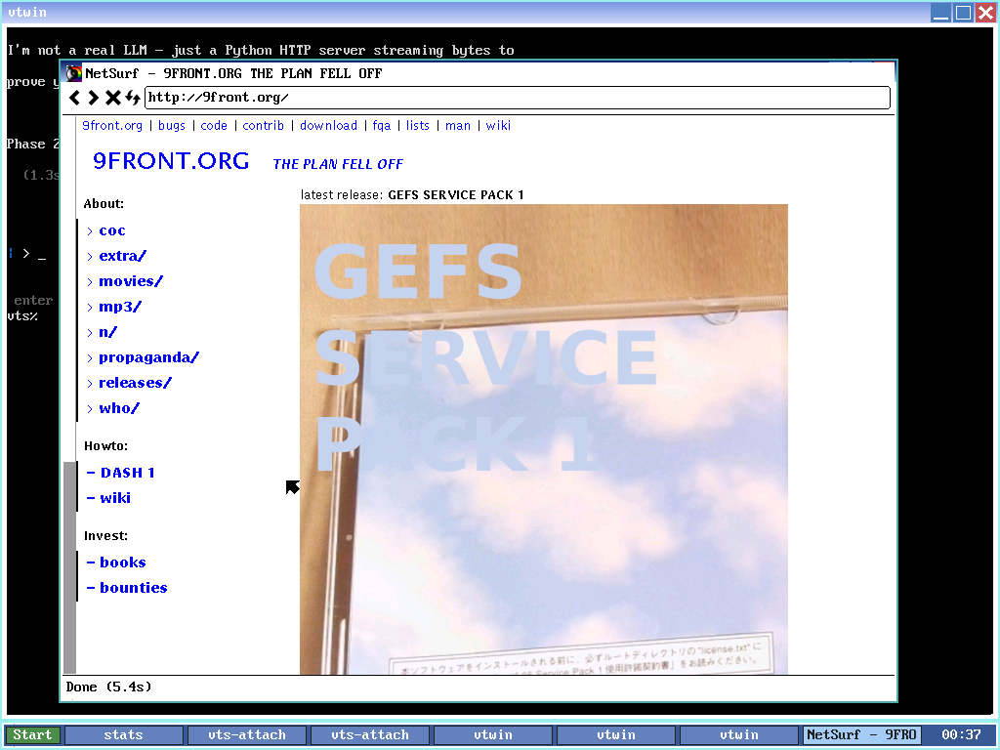

# NetSurf on 9front

How to build, install, and run NetSurf inside our 9front amd64 VM. Tested
end-to-end 2026-05-17, see [[log#2026-05-17 feat | netsurf installed]].

NetSurf is a small (~52 MB amd64), libdraw-native web browser by the
NetSurf team, ported to 9front by the `netsurf-plan9` GitHub org. Renders
HTML5 + CSS2 cleanly. **JavaScript support is essentially nothing in
practice** — Duktape is linked but the DOM bindings are partial, so JS-gated
sites (Google search, Gmail, Discord) refuse to serve content. Static-HTML
sites (Wikipedia, 9front.org, plan9.io, MDN, most blogs) render correctly.



## Repos

| What                    | URL                                              |
|-------------------------|--------------------------------------------------|
| Port wrapper            | https://github.com/netsurf-plan9/nsport          |
| Upstream NetSurf source | https://git.netsurf-browser.org                  |
| Tutorial                | http://docs.nastycode.com/9/netsurf/             |

The wrapper repo (`nsport`) contains `mkfile`, posix shims, and a `fetch`
script that clones the 18 NetSurf sub-libraries (libcss, libdom, libhubbub,
libnsbmp, libnsgif, libsvgtiny, libwapcaplet, etc.) plus expat, zlib,
libjpeg, libpng, nsgenbind, and NetSurf itself. All clones land under
`nsport/` as siblings of `mkfile`.

## Install procedure (verified 2026-05-17)

All steps below assume the build pattern from [[testing-harness]] is set
up — `aux/listen1` on host port 1717, `scripts/vm-rc` works.

### 1. Clone the port wrapper + all sub-modules

```rc
cd $home
git/clone https://github.com/netsurf-plan9/nsport
cd nsport
fetch clone http
```

Time: ~5-7 minutes (18 sequential git/clone calls over SLIRP-emulated network,
~1700 objects for the netsurf repo alone — the rest are small).

To run this from the Mac via the host-side helper:

```bash
# scripts/run-fetch.rc inside the VM via hget
scripts/vm-rc 'rc /tmp/run-fetch.rc >/dev/null >[2=1] &'
scripts/vm-fetch-status     # poll: '==> netsurf' / '==> nsgenbind' / done
```

### 2. Build

```rc
cd $home/nsport
mk
```

Time: **18-22 minutes on our TCG-emulated amd64 VM** (Apple Silicon host
running QEMU TCG; no KVM/HVF on a different arch). Roughly:
- 7-8 min for the 17 sub-libraries (~550 cc invocations)
- ~12 min for netsurf itself + the Duktape JS engine (~400 more cc
  invocations + one giant link step linking 932 .6 files into 6.netsurf)

Sentinel: when `/usr/glenda/nsport/netsurf/6.netsurf` exists with size
≥ 50 MB, the build succeeded.

```bash
# Host-side polling
scripts/vm-rc 'rc /tmp/run-mk.rc >/dev/null >[2=1] &'
scripts/vm-build-status     # cc count / stages / done sentinel
```

### 3. Install

```rc
cd $home/nsport
mk install
```

This step is fast (~1 min). Does three things:
1. Generates `resources/Messages` from `resources/FatMessages` (i18n compile).
2. `dircp resources /sys/lib/netsurf` — copies CSS, default theme, icons,
   ca-bundle, welcome.html, multi-lingual message catalogs.
3. `cp 6.netsurf /amd64/bin/netsurf` — installs the binary into `$PATH`.

### 4. Verify

```rc
ls -l /amd64/bin/netsurf      # ~52 MB
lc /sys/lib/netsurf           # FatMessages, Messages, ca-bundle, *.css, en/, fr/, ...
```

Launch in a fresh mxio window:

```rc
window -r 60 60 920 720 netsurf http://9front.org
```

(URL is optional — without it NetSurf opens `file:///sys/lib/netsurf/welcome.html`.)

## What works

- HTML5 + CSS2 rendering, including images (PNG/JPEG/GIF/BMP/SVG via libsvgtiny)
- HTTPS via webfs (already running in our profile)
- Cookies (`webcookies` already running)
- DNS via `cs` / `dns` (already running)
- Mxio integration: window appears in taskbar with title "NetSurf - <page title>",
  resizes correctly under mxio's WinXP titlebar.
- Multiple concurrent windows: `window -r ... netsurf URL` spawns each as a
  fresh process; they don't share state.

## What doesn't work

| Surface                       | Status                                            |
|-------------------------------|---------------------------------------------------|
| Modern JS apps                | No — Duktape is linked but DOM bindings minimal  |
| Google search results page    | Refuses to render ("habilita JavaScript")        |
| Gmail / GitHub web UI         | Empty white page                                  |
| Wikipedia, MDN, plan9.io      | Works                                             |
| Hacker News                   | Works (mostly static)                            |
| 9front.org / cat-v.org        | Works                                             |
| Image-heavy news sites        | Works but slow image decode on TCG (5-15s per page) |

This is the trade-off in the [[browser-webview-plan9]] comparison: NetSurf
gets you a working browser **today** with no JS support. A real modern
engine (WPE WebKit) would take 12-18 months of porting work to render a
single page.

## Adding NetSurf to the start menu

`src/launcher/launcher.c` has a hardcoded `items[]` array. Add:

```c
{ "NetSurf",     "window netsurf",                       {0,0,0,0} },
```

Right above `Reboot`. Rebuild launcher (`cd /sys/src/cmd/launcher && mk install`
inside the VM, or push + build via the standard [[build-toolchain]] flow).

**Better long-term:** rip out the hardcoded array and load `/lib/xena/menu` as
a config file. Tracked as todo for `xena-panel`.

## Pitfalls

### `mk` produces nothing visible while linking

After 18/19 sub-stages, the last stage is one giant `pcc -o 6.netsurf ...`
call linking 932 .6 files. On TCG this takes 3-5 minutes during which the
log file size stays exactly the same (no newline emitted) and `ps` shows no
processes (the link runs as a single libloader sub-invocation we don't see
without `mk -d`). If your build status script reports "stuck", check whether
`netsurf/6.netsurf` exists — if it does, you're done.

### Don't run `netsurf` directly from `listen1`

NetSurf calls `initdraw`, which mounts a window from `/dev/wsys/$winid`.
The aux/listen1 child inherits `/dev/wsys` but does not have a window
context. Launch via `window -r X Y X' Y' netsurf URL` so rio/mxio creates
the wsys directory.

### The `mk install` step also took ~minutes

Mostly `dircp resources/en /sys/lib/netsurf/en` and friends — lots of small
file copies through hjfs. Don't kill it early just because it's quiet.

### `kill netsurf | rc` leaves orphaned windows

The window stays as a blank rectangle until the WM repaints. Click anywhere
else first, then back, to force the repaint. Or run
`for(w in /dev/wsys/?){ echo current > $w/wctl }` to force-redraw everything.

### TCG performance ceiling

Cold-launch NetSurf + load 9front.org = ~5-7 sec on our setup. Image-heavy
pages with PNG decoding can hit 15+ sec. This is the TCG cost, not NetSurf's
fault — pcc and the kernel both run faster on native Plan 9 hardware.

## Helper scripts (added 2026-05-17)

Under `scripts/`:

| Script               | Purpose                                                  |
|----------------------|----------------------------------------------------------|
| `vm-rc`              | Run a single rc command in the VM via `nc → :1717`. Handles rc redirect quirks. |
| `vm-fetch-status`    | Count `==>` lines in `/tmp/nsfetch.log` — how many sub-libs cloned. |
| `vm-build-status`    | Count `Building:` stages + cc invocations + done sentinel. |

Each is a bash-wrapper around `printf '<rc>\n' | nc -w 10 127.0.0.1 1717`.
The double-shell quoting between bash and rc bites here — single-quote
regex-containing rc commands when invoking vm-rc. See `scripts/vm-rc` source
for the gotcha section.

## See Also

- [[browser-webview-plan9]] — the long-term browser strategy (NetSurf vs WPE vs custom)
- [[build-toolchain]] — generic Plan 9 build pipeline
- [[testing-harness]] — `aux/listen1` + screendump + vision_analyze loop
- [[mxio-design]] — what hosts the NetSurf window
- [http://docs.nastycode.com/9/netsurf/](http://docs.nastycode.com/9/netsurf/) — upstream install tutorial
