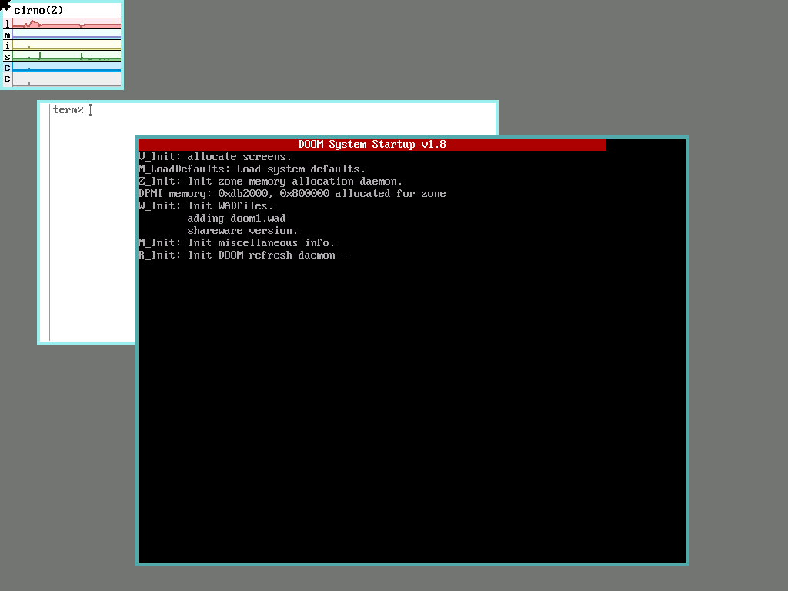
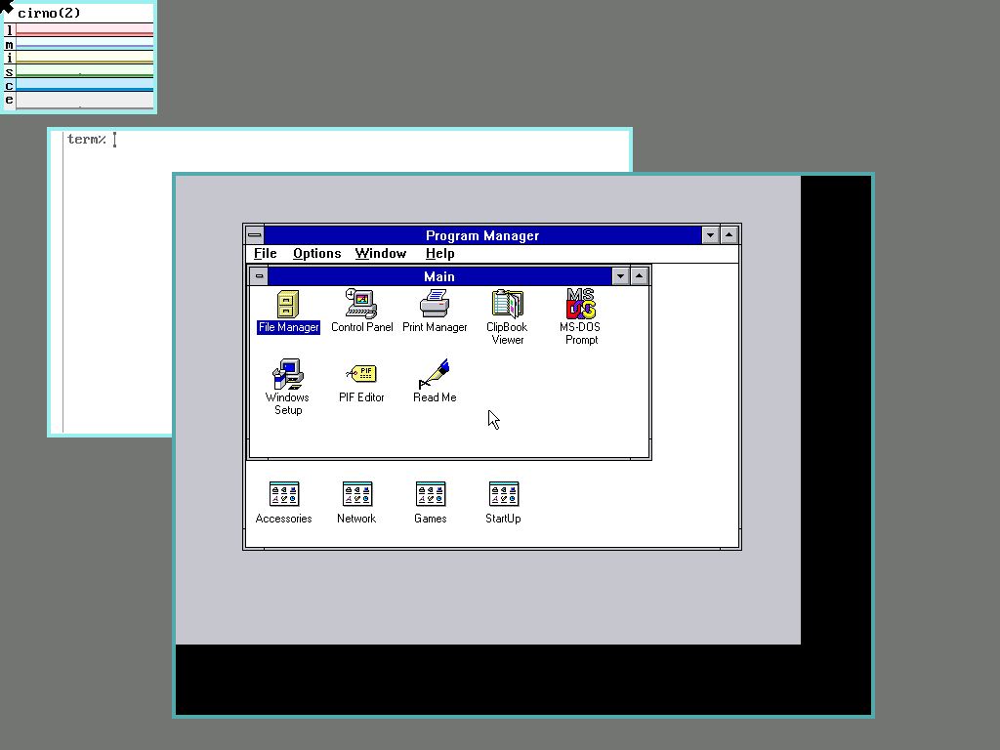
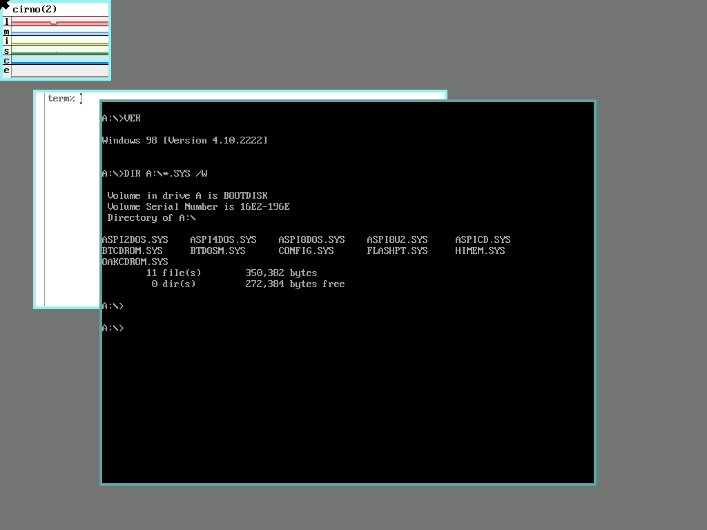
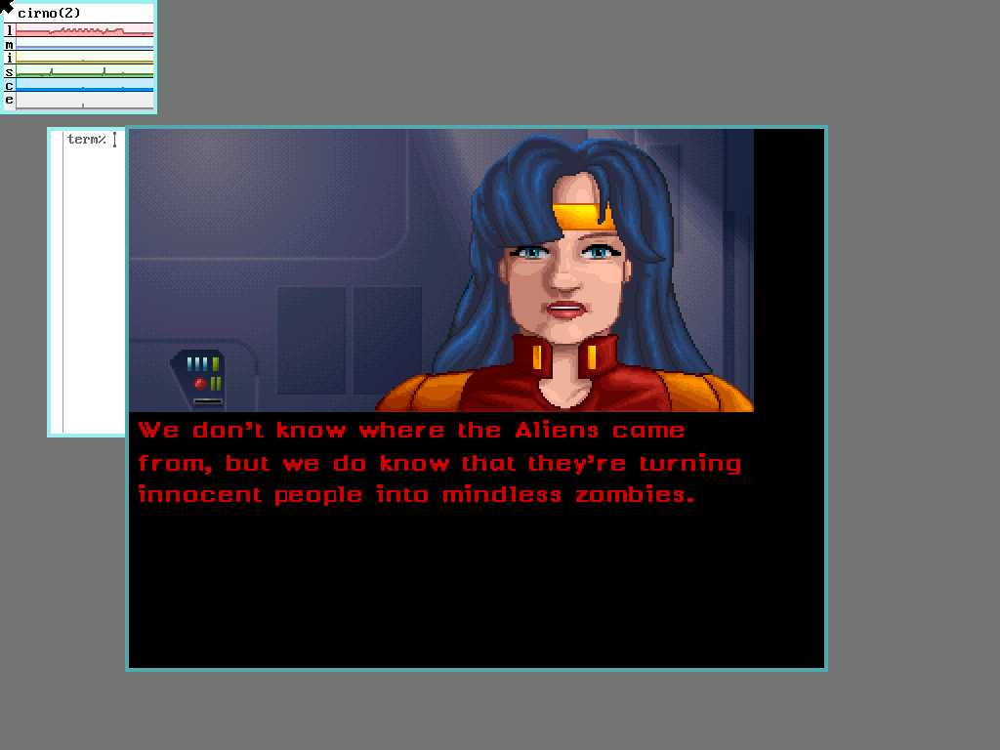

# dosbox9 — DOSBox on 9front

Real upstream [DOSBox](https://www.dosbox.com/) 0.74-3 — the DOS emulator —
running on stock 9front/amd64, in a rio window, on bare metal.

All 118 DOSBox `.cpp` files compile unmodified at `-std=c++23` with
[cc9](../cc9/); the port is really an SDL port. We vendored real SDL 1.2.15 and
wrote two backends for it (video over the gl9win2 protocol, audio over
`/dev/audio`). **12/12 shareware games launch and render** on bare metal.



## Install (on 9front)

    pac9 install dosbox9

then, from a rio window:

    dosbox9 /path/to/dos/game/dir

which mounts that directory as `C:`. Keyboard works end to end; VGA/EGA/CGA
graphics, PC speaker and Sound Blaster / AdLib are all on.

## Windows

A real Windows desktop, on 9front, on bare metal — Windows 3.11 for Workgroups'
Program Manager, mouse and all:



No `boot` needed: `WIN.COM` is an ordinary DOS program, so it's just a `mount`
and a `win`. Point `C:` at an installed `WINDOWS` tree and go — a preinstalled
one is the archive.org `install-me` item's `WINDOWS.zip` (~15 MB extracted):

    [dosbox]
    machine=svga_s3
    memsize=16
    [cpu]
    core=normal
    cycles=max
    [autoexec]
    mount c /tmp/d9/w311
    c:
    cd \WINDOWS
    win

Windows 98 boots too — but only as far as **real mode**:



That's a Win98 SE boot floppy started with DOSBox's `BOOT.COM`: Microsoft's own
`IO.SYS` and `COMMAND.COM` at an interactive prompt, having loaded the real-mode
`CONFIG.SYS` driver stack (Oak ATAPI, Adaptec ASPI, a PCI bus scan) on the way in.
The image is the archive.org `win-98-se-boot-disk` item:

    [dosbox]
    machine=svga_s3
    memsize=32
    [cpu]
    core=normal
    cputype=pentium_slow
    [autoexec]
    mount c /tmp/d9
    c:
    boot c:\win98.img -l a

**The Win98 GUI does not run, and won't.** As soon as `WIN.COM` starts,
`VMM32.VXD` wants protected-mode/V86 and IDE emulation that vanilla DOSBox 0.74
has never implemented — which is why "Windows 98 in DOSBox" always means
**DOSBox-X**, a different and much larger port. That ceiling is upstream
DOSBox's, not 9front's or cc9's: 0.74-3 gets exactly as far here as it does on
Linux. Windows 3.x is where 0.74's GUI story ends, and it ends well.

Two traps if you reproduce the Win98 half: the image needs an **8.3 name**
(`win98.img`, not `win98boot.img` — `BOOT` just says "Bootdisk file does not
exist"), and patch the floppy with `mtools`, never by mounting it on macOS
(the OS writes `System Volume Information` into your boot disk).

## Architecture

Two processes, three fds. cc9 emits a **System-V-ABI** Plan 9 a.out and libdraw
is **kencc** objects, so they cannot link — dosbox9 does not draw. It speaks the
**gl9win2** protocol to a native window server reused *unmodified* from
[alacritty9](../alacritty9/) (see [PROTOCOL.md](../alacritty9/PROTOCOL.md)):

| fd | direction | contents |
|----|-----------|----------|
| 0  | win → app | 16-byte big-endian event records |
| 1  | app → win | `GL9F` full frames / `GL9D` damage rects / `GL9T` title |
| 2  | app → win | stderr passthrough |

```
gl9win2 (kencc, owns the rio window)
   └── dosbox (cc9 / SysV a.out)
         └── SDL 1.2.15 + port/plan9/SDL_p9video.c, SDL_p9audio.c
```

`stdout` **is** the frame stream, so any stray `printf` in DOSBox corrupts
framing and kills the window; `GFX_ShowMsg` is patched to stderr for exactly
that reason.

## Build

    host/build-sdl.sh      # -> lib/libSDL.a      (SDL 1.2.15 + our backends)
    host/build-dosbox.sh   # -> _out/dosbox.aout  (118 .cpp + libSDL + libcc9cxx)
    host/fetch-games.py && host/prep-games.sh && host/gen-confs.py   # the C: tree
    host/deploy.sh [game]  # ship to a 9front box and run

Needs cc9's runtime built first (`cc9/host/build-runtime.sh`).

## Status

12/12 games render on bare metal (Doom, Wolfenstein 3D, Commander Keen 1 & 4,
Jill of the Jungle, Crystal Caves, Raptor, Blake Stone, Duke Nukem II, Bio
Menace, Halloween Harry, Hocus Pocus), plus Windows 3.11 and the Win98 boot
floppy above.

Damage-rect presentation (`GL9D`) is the default and is pixel-correct; set
`P9_FULLFRAMES=1` to force whole frames. Sound is wired but **nobody has
actually listened to it yet**. The interpreter CPU core is why game startup takes
tens of seconds — `C_DYNREC` needs W^X and a real `mprotect`, which cc9 doesn't
have.

The engineering detail, the measurements, and every trap worth knowing are in
[PORT-NOTES.md](PORT-NOTES.md) — including the alpha-blend bug that made the
delta path look broken for three sessions, and why full frames looked innocent.


