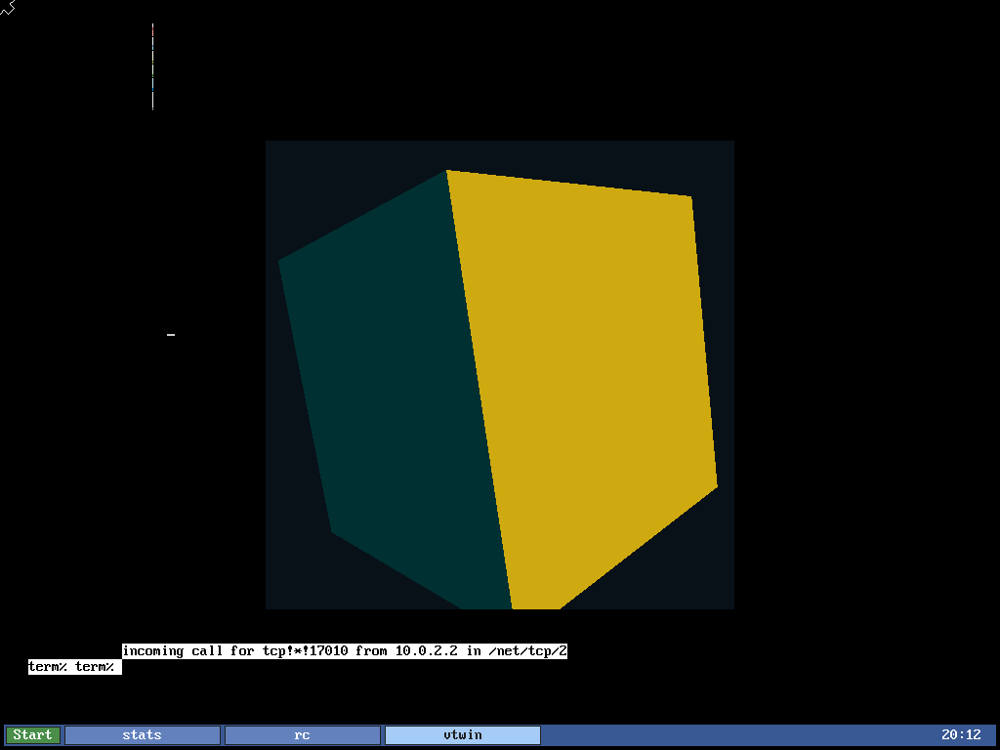

# gl9 — real OpenGL on 9front via Mesa softpipe

9front has no OpenGL and no 3D — native graphics is 2D `libdraw` → `/dev/draw`.
gl9 ports **Mesa 24.0.9's softpipe** (the pure-C gallium *software* rasterizer,
GL 3.3 / GLES 3.x complete) to 9front, cross-compiled with **cc9** (the repo's
clang→9front a.out toolchain). No GPU, no LLVM/JIT, no kernel patch. The north
star is running **Alacritty** on 9front — which is why the target is real modern
GL (shaders, VBO/VAO, instanced quads), not a fixed-function toy like TinyGL.

Status: **complete.** All ~800 softpipe+OSMesa+GLSL/NIR TUs compile+link for
`x86_64-plan9` with cc9; the 6-program modern-GL corpus is **byte-identical to
host Mesa softpipe (6/6 PASS, maxΔ=0)**; frames blit to a live 9front window via
`gl9win` (libdraw); and both OSMesa and a minimal **EGL** API render on-screen
(`screenshots/`). The Alacritty seam (EGL) works — remaining for Alacritty itself
is a winit Plan 9 backend + a Rust toolchain (out of scope; no rust9). See
`port/plan9/NOTES.md` for the full dev log and
`docs/plans/2026-07-01-gl9-opengl-mesa.md` for the plan.

**A perspective-projected, depth-tested, Phong-lit spinning cube — real 3D
OpenGL, rendered by softpipe on 9front and blitted to a window by gl9win:**



## Demos (all captured on the 9front VM via QMP screendump)

| Demo | What it shows | Run |
|---|---|---|
| `test/corpus/cube_demo.c` | animated 3D cube: perspective mat4, depth test, per-pixel Phong + specular ([cube](screenshots/cube-3d-lit.png), [angle 2](screenshots/cube-3d-lit-angle2.png)) | `cube_demo \| gl9win` |
| `test/corpus/win_demo.c` | Gouraud triangle via OSMesa → libdraw window ([shot](screenshots/phase2-shaded-triangle.png)) | `win_demo \| gl9win` |
| `test/corpus/egl_demo.c` | same, driven through the **EGL** API (the Alacritty seam) ([shot](screenshots/phase4-egl-triangle.png)) | `egl_demo \| gl9win` |

Build a demo with `python3 host/build-gl9.py link test/corpus/<name>.c` (EGL adds
`port/plan9/egl/gl9egl.c`), deliver to the VM, then run the pipeline with
`GALLIUM_NOSSE=1`. `gl9win` is built on the VM (`mk` in `port/plan9/win/`).

## How it builds

Mesa uses meson and generates a lot of C at configure time. gl9 lets meson do
that on a Linux host, then compiles the result with cc9:

```
fetch.sh                      -> vendor/mesa (Mesa 24.0.9, pinned+shasum'd)
host/linux-configure.sh       -> meson+ninja in a linux/amd64 container:
                                 generated sources + compile_commands.json + amd64
                                 oracle libs (reused as parity goldens)
host/harvest.py               -> harvest.json: per-TU defines/includes/std, paths
                                 remapped to the host, Linux/glibc/asm -D scrubbed
host/build-gl9.py             -> cc9 clang over the file set + shim/gl9_pre.h
                                 -> libgl9mesa.a  (then link a main -> a.out)
```

Presentation (Phase 2+): because cc9's System-V a.out can't link kencc's libdraw,
the Mesa process `write()`s framed RGBA to `port/plan9/win/gl9win.c`, a native
libdraw blitter (the `src/vtwin` two-process pattern). That `write()` is the seam
OSMesa uses now and EGL's SwapBuffers reuses in Phase 4.

## Quick start (host)

```sh
sh fetch.sh                        # vendor Mesa
sh host/linux-configure.sh         # generate + oracle (needs docker; ~slow, emulated)
python3 host/harvest.py            # -> host/harvest.json
python3 host/build-gl9.py enumerate  # compile-all, list remaining shim gaps
```

## Layout

```
fetch.sh                 pin + fetch Mesa 24.0.9
host/                    Dockerfile, linux-configure.sh, harvest.py, build-gl9.py, build-host-refs.sh
port/plan9/shim/         gl9_pre.h (force-included compile shim), gl9_os_extra.c, include/strings.h
port/plan9/patches/      2 minimal Mesa patches (os_misc/os_time platform fallbacks)
port/plan9/win/          gl9win.c + mkfile — native libdraw blitter (Phase 2)
port/plan9/egl/          gl9egl.c — minimal libEGL over OSMesa (Phase 4, the Alacritty seam)
port/plan9/NOTES.md      dev log / port archaeology
test/corpus/             glharness.h + 00..06 parity programs, win_demo, egl_demo
test/                    goldens/, run_gl9.py, ppmdiff.py, parity/manifests/qemu.json
screenshots/             phase2 (window) + phase4 (EGL) rendered on 9front
vendor/mesa/             Mesa 24.0.9 (gitignored; fetch.sh)
```

## Presentation & EGL

cc9's System-V a.out can't link kencc's libdraw, so rendering (Mesa, cc9) and
windowing (libdraw, kencc) are two processes joined by a pipe: `glapp | gl9win`.
The app writes framed RGBA; `gl9win` blits it to a 9front window. `gl9egl`'s
`eglSwapBuffers` writes the same frame, so a glutin-style EGL client renders to a
window with no OSMesa knowledge. **All GL runs need `GALLIUM_NOSSE=1`** — Mesa's
`translate_sse` JITs x86 for vertex fetch and 9front NX-faults it; NOSSE forces the
pure-C path.

