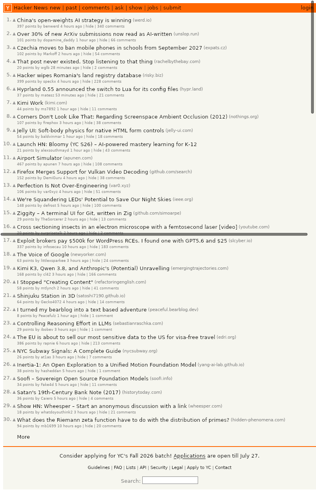
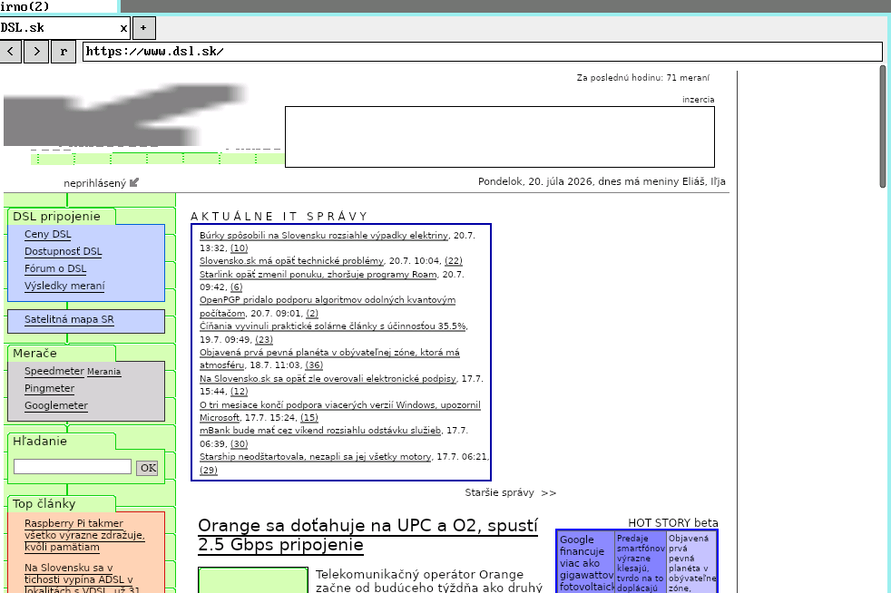
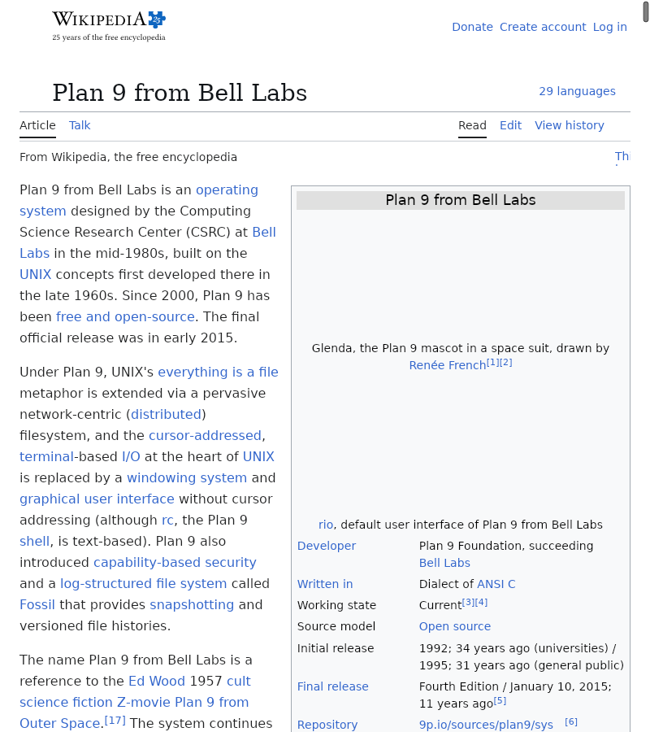

# ladybird9 — the Ladybird browser on 9front

A native port of [Ladybird](https://github.com/LadybirdBrowser/ladybird) — the
from-scratch, independent C++23 browser engine — to Plan 9 / 9front, cross-built
with the [cc9](../cc9) toolchain. It runs the **real** LibWeb + LibJS engine
(not a re-implementation): modern HTML5, CSS3, and JavaScript, Skia CPU raster,
ICU, curl + OpenSSL, and the ~10 mandatory Rust crates — as native Plan 9 amd64
`a.out` binaries.

*news.ycombinator.com rendered headless by ladybird9 on bare-metal 9front (cirno).*

## Is it done? Is it a faithful port?

**Faithful — yes.** It is a genuine platform port, the same way the Windows and
Android ports landed upstream: additive `AK_OS_PLAN9` arms plus new platform
files (`Libraries/LibIPC/TransportPlan9`, `UI/Plan9/`, a `#g`-segment shared-mem
backend in cc9). **No shared engine logic is rewritten.** Parity is *measured*,
not asserted: `--headless=text` DOM dumps come out **byte-identical** to the
same-commit host (macOS) build, and the LibJS smoke battery matches too. The
deferrals (below) all go through upstream's own feature gates.

**Done — the engine is; the product is usable.** What works today:

- Renders real modern pages — Wikipedia, HN, dsl.sk, styled content — with
  correct CSS layout, fonts, colors, **images**, and working JavaScript.
- HTTPS over OpenSSL out of the box (Mozilla CA roots bundled) — no hand-fetching
  a bundle. The full multi-process stack (UI + WebContent + Compositor +
  RequestServer + ImageDecoder + WebWorker) over `TransportPlan9`.
- **Browser chrome**: a real tab strip, address bar, and back/forward/reload,
  drawn presenter-side in `gl9win2` — `ladybird <url>` opens a usable window.
  macOS-style Super-key chords (`Super-L` focus + select-all, `Super-T`/`W`/`R`)
  and Plan 9 line editing in the address bar.
- **Headless**: `ladybird --headless --screenshot-path shot.png <url>`.
- Persistent profile (history/cookies survive restarts). `pac9`-installable
  (see below). Cold-start on real hardware ≈ **3.7 s**.

What is **not** done:

- **Heavy client-rendered SPAs don't settle.** A page like youtube.com never
  finishes its client-side render and can drive a small box out of memory;
  static and moderate sites render fully.
- No JS JIT — LibJS runs upstream's assembly *interpreter* (the JIT was removed
  upstream), same as the macOS build, so heavy JavaScript is slow on a slow CPU.
- **Deferred features** (tracked in [`parity/deferrals.md`](parity/deferrals.md),
  all via upstream gates): `<video>`/`<audio>` decode is built (ffmpeg 7.1.1)
  but there is no 9front audio-out backend, so playback is silent/decode-only;
  WebGL runs on gl9/Mesa softpipe (no GPU); JPEG-XL/AVIF decode is on.
- It's **heavy**: six static `a.out`s (~400 MB), so first paint has real latency.

**Pin:** upstream master `8cc5d7a5ff` (2026-07-15). Upstream has no releases and
is maintainers-only, so this is a permanent pinned fork; `fetch.sh` reproduces
the tree and applies `port/patches/`.

## Screenshots

| | |
|---|---|
|  |  |
| Interactive: **browser chrome** — tab strip, address bar, back/forward/reload — in a rio window (dsl.sk) | Wikipedia — full article layout, pixel-correct CSS + fonts |

*(The Hacker News shot at the top of this README is a current headless render —
note the correct fonts and the rendered `Y` logo image.)*

## Install with pac9

ladybird9 ships as a prebuilt cross-compiled tarball (it can't build on 9front —
it needs host clang/cmake/rust), exactly like rust9 and tailscale9. Once the
release is published, on any 9front box:

    pac9 install ladybird9
    ladybird https://example.com          # opens a rio window
    # headless:
    ladybird --headless --screenshot-path /tmp/shot.png https://example.com

HTTPS works out of the box — the package bundles the Mozilla CA roots
(`share/ca.pem`) and the launcher passes `--certificate` to RequestServer, so
there is **no** need to hand-fetch a CA bundle into `/sys/lib/tls/ca.pem`.

The registry entry (in `/sys/lib/pac9/registry`) is:

    ladybird9	-	.	tarball https://github.com/Alino/agent9/releases/download/ladybird9-v0.2.0/ladybird9-amd64.tar.gz	-	0.2.0

`pac9` fetches the tarball, lays it out under `/usr/glenda/ladybird9`, and drops
a launcher at `/rc/bin/ladybird`. It bundles the browser + 5 helper processes +
resources + ICU data + the CA bundle + a private copy of the `gl9win2`
presenter. `pac9 uninstall ladybird9` / `pac9 changelog ladybird9` / `pac9
upgrade` all work.

> To try a build before it's published, serve the tarball locally and point the
> registry at it — see `release/test-install.rc`.

## vs. NetSurf on Plan 9

[NetSurf](https://www.netsurf-browser.org/) also has a (work-in-progress) 9front
port ([netsurf-plan9/nsport](https://github.com/netsurf-plan9/nsport), already in
the pac9 registry). They aim at different points:

| | NetSurf (Plan 9) | ladybird9 |
|---|---|---|
| Engine | Own bespoke engine (HTML 4 + CSS 2.1) | **Real Ladybird LibWeb** — HTML5 + modern CSS3 |
| JavaScript | Duktape, limited (the usual weak spot) | **Full LibJS** (AsmInt interpreter), real ES |
| Layout | Own | LibWeb — flexbox, grid, modern box model |
| Rendering | Native Plan 9 `draw` | Skia CPU raster (→ libdraw window via gl9win2) |
| Processes | Single, lightweight | Multi-process (6), heavy |
| Footprint | A few MB | ~400 MB static binaries, ~3.7 s cold-start |
| Browser chrome | **Native front-end** (tabs, URL bar) | **Tabs, address bar, back/forward/reload** (gl9win2) |
| Modern sites | Struggle (limited JS/CSS3) | **Render faithfully** (HN, speedtest.net, …) |
| Maturity on 9front | WIP, no releases | M0–M6 complete, pac9-installable, parity-measured |
| TLS/HTTPS | Yes | Yes (OpenSSL / ssl9) |

**They're complementary.** NetSurf is the pragmatic *lightweight, usable-today*
browser — it has a real native UI, starts instantly, and sips memory, which is
perfect for simple or older sites. ladybird9 is the *modern-web-fidelity* option
— it's the real engine used by a from-scratch standards browser, so it renders
today's JS/CSS3 sites correctly, at the cost of being heavyweight. If you want a
lightweight browser for simple sites on Plan 9 today, NetSurf. If you want the
*real modern web engine* on Plan 9, ladybird9.

(For contrast, the stock 9front browsers — Mothra, Abaco — predate CSS entirely.)

## Keeping 1:1 parity with upstream

Because the port is **additive patches over a pinned commit**, syncing to a newer
Ladybird is a bounded, mechanical job:

1. **Bump the pin.** Edit `LADYBIRD_REV` in `fetch.sh` to the new commit.
2. **Re-apply.** `./fetch.sh` resets `vendor/ladybird` to the new pin (`git reset
   --hard`) and re-applies `port/patches/*.patch` in order.
3. **Resolve conflicts** where upstream touched the same lines a patch does. The
   patch series is deliberately split so each conflict points at one concern:
   - `0005` (TransportPlan9), `0008` (UI/Plan9 + LibMedia stubs) are **new files**
     → they essentially never conflict.
   - `0001` (AK/Platform.h), `0003` (LibCore), `0007` (LibWeb/Services) are small
     `#if AK_OS_PLAN9` arms → they conflict only if upstream refactors that exact
     function. Most upstream feature work applies cleanly around them.
   - `0004` (build system / CMake) is the most fragile — CMake churns upstream.
4. **Re-pin deps** if upstream bumped Skia / ICU / curl (recipes in `host/deps/`).
   Skia is the heaviest to re-pin.
5. **Rebuild + re-measure parity.** `host/build-ladybird.sh`, then the ledgers in
   `parity/` catch any regression, and `port/regen-patches.sh` rewrites the
   series from the updated tree.

**Effort:** a routine sync (weeks of upstream commits, no big refactor) is a few
hours of `git apply` conflict resolution + a rebuild + a parity check. A major
upstream refactor of a seam we patch (IPC transport, `anon_create`, the font or
build plumbing) can be a few days. The whole point of the surgical/additive
discipline — never rewrite shared logic, keep patches single-purpose and
upstream-path-preserving — is to keep that cost low and auditable.

## Layout

    fetch.sh          pin + clone (vendor/, gitignored) + apply port/patches/
    port/patches/     the permanent fork surface, one purpose per patch (0001-0008)
    port/regen-patches.sh   rewrite the series from the current vendor tree
    host/             build + deploy scripts (build-ladybird.sh, deploy9.sh, vm/)
    release/          make-tarball.sh (pac9 package), CHANGELOG, test-install.rc
    parity/           measured-parity ledgers + deferrals + screenshots
    test/m0/          wall-gate spikes (cc9-side gates live in cc9/test/)
    _out/, vendor/    gitignored build products + the upstream tree

Full design + milestone history: `docs/plans/2026-07-15-ladybird9-browser.md`.
