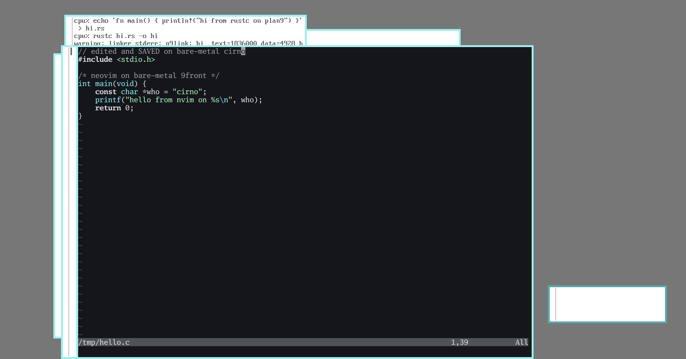

# neovim9 — Neovim on 9front

Real upstream [Neovim](https://neovim.io) v0.12.4 running on stock
9front/amd64 — full TUI with treesitter highlighting, jobs, `:terminal`, and
LSP, inside [alacritty9](../alacritty9/), on bare metal.

One static Plan 9 a.out (8.5 MB): nvim + LuaJIT (interpreter mode — stock
9front is W^X, no JIT) + libuv 1.52.1 + tree-sitter with six parsers compiled
in (c, lua, vim, vimdoc, query, markdown) + luv/lpeg/unibilium/utf8proc,
compiled with the [cc9](../cc9/) toolchain (host clang → Plan 9 a.out). The
port is what forced cc9 to grow a real POSIX process layer: `poll(2)`
emulation, working `fork`/`execve`, async child reaping, and honest
thread-exit semantics — all of it now shared by every cc9 program.

## Install (on 9front)

    pac9 install neovim9

then, from an alacritty9 window (or any terminal that sets `$TERM`):

    nvim

Editing, `:w`, treesitter `:syntax` colors, `:!cmd`, `system()`,
`jobstart()` with callbacks, an interactive `:terminal` running rc, and LSP
over stdio pipes all work. The runtime tree installs at nvim's compiled-in
`/usr/local/share/nvim/runtime`, so no launcher or `$VIMRUNTIME` is needed.

## Performance (measured on a fanless Celeron)

Startup is ~350 ms (thin UI client 31 ms + embedded server 225 ms + attach —
nvim 0.12 is a two-process TUI). Keystroke→pixels through alacritty9 is
~22 ms. Directory browsing got the port treatment: netrw's per-file classify
loop runs as one lua pass (`runtime/lua/netrw_fastlist.lua`, ~0.2 ms/file
instead of 8.3), the `FileType` re-fire per browse is guarded, and
`g:netrw_fastbrowse` defaults to 2 — revisiting a 300-file directory takes
5 ms. Reused listings can go stale; `ctrl-l` refreshes, or
`let g:netrw_fastbrowse=1` for always-fresh.

## Architecture

    alacritty9 window
      └─ rc -i  (the shell alacritty spawns)
           └─ nvim            TUI client: ~31ms, thin — spawns and attaches to
                └─ nvim --embed   the real editor, over stdio pipes (msgpack-rpc)

No pty on Plan 9: `:terminal` is a duplex pipe pair + `fork` — the missing
line discipline is emulated inside nvim (ICRNL, ONLCR via `force_crlf`,
local echo keyed off in-flight escapes), and rc gets `-i` so it prompts.
Terminal size travels as live `/env/LINES` + `/env/COLS` files (a poller
thread raises `SIGWINCH`). `^C` arrives as a Plan 9 note that crt0 maps to
`SIGINT`. There is no `dlopen` in a static a.out, so treesitter parsers are
linked in behind a `__plan9__` registration table, with empty
`runtime/parser/<lang>.so` marker files satisfying lua-side discovery
(`ffi.load` can't resolve symbols either — plugins that need it won't).

What cc9 grew for this port (`cc9/runtime/`, reusable by anything):

    poll.c        poll(2) readiness: per-fd reader thread + ring buffer +
                  one counting semaphore; read()/close() divert through it
    posix_llvm.c  real fork (rfork), execve (envp → private /env +
                  FD_CLOEXEC sweep), waitpid/WNOHANG via a reaper thread
                  reading /proc/<forker>/wait, kill() over /proc notes
    fs.c          stat(5) Dir.type '|' → S_IFIFO (pipes must not look like
                  files or libuv wedges), TIOCGWINSZ over /env, isatty
    crt0.c        note → signal dispatch; a shared exit epilogue that kills
                  surviving worker threads (Plan 9 doesn't reparent orphans
                  — a leaked reader steals the parent shell's stdin)

## Layout

    vendor/neovim/      upstream v0.12.4 checkout + the patch set
    port/               host build pipeline (no cmake on 9front):
      build-luajit.sh     LuaJIT cross, TARGET_SYS=Other, interp-only
      build-libuv.sh      libuv 1.52.1, posix-poll backend + uv-plan9.c
      build-deps.sh       unibilium/utf8proc/tree-sitter/lpeg/luv + parsers
      build-nvim.py       the harvest bridge: host reference build →
                          `ninja -t inputs` object list → recompile with cc9
      patches/            luajit / libuv / nvim-plan9.patch (9 files)
      qmp.py              dev-loop: type/screenshot the qemu VM over HMP
    test/               gate tests (ljgate.lua, pollgate.c, uvgate.c,
                        lsp-server.lua + lsp-client.lua)
    release/            make-tarball.sh → the pac9 package
    screenshots/        acceptance evidence (VM + bare-metal cirno)
    PLAN.md             gate-by-gate log of how the port actually went

## Build (on the Mac host)

    # once: cc9 toolchain built (see cc9/), /tmp/libcxx-thr present
    port/build-luajit.sh && port/build-libuv.sh && port/build-deps.sh
    python3 port/build-nvim.py          # → _out/nvim.aout
    release/make-tarball.sh             # → the pac9 tarball

The gates, each live-verified (qemu VM, acceptance also on bare-metal cirno):
G1 LuaJIT interpreter (ljgate 12/12); G2 poll layer + libuv (pollgate 12/12,
uvgate 8/8); G3 headless nvim round-trip; G4 the TUI inside alacritty9 with
treesitter (the acceptance bar); G5 jobs, `:terminal`, LSP handshake+hover,
and the pac9 package.

## Known limits

tcp/udp are ENOSYS (no BSD sockets yet — LSP runs over stdio);
`v:servername`/`--listen` need `uv_pipe_bind` (unported); `ffi.C`/`ffi.load`
can't resolve symbols in a static a.out; treesitter languages are the six
compiled in.
